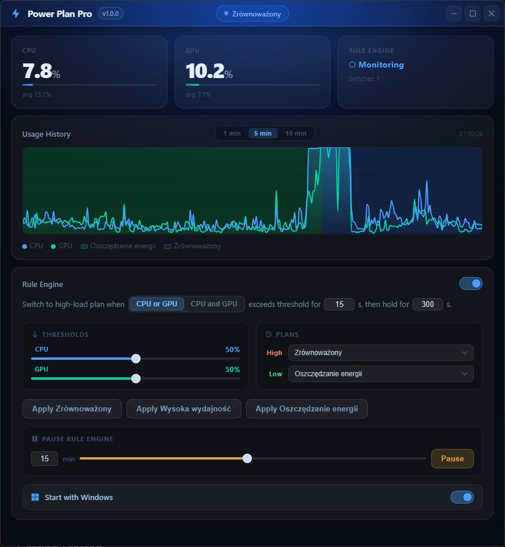
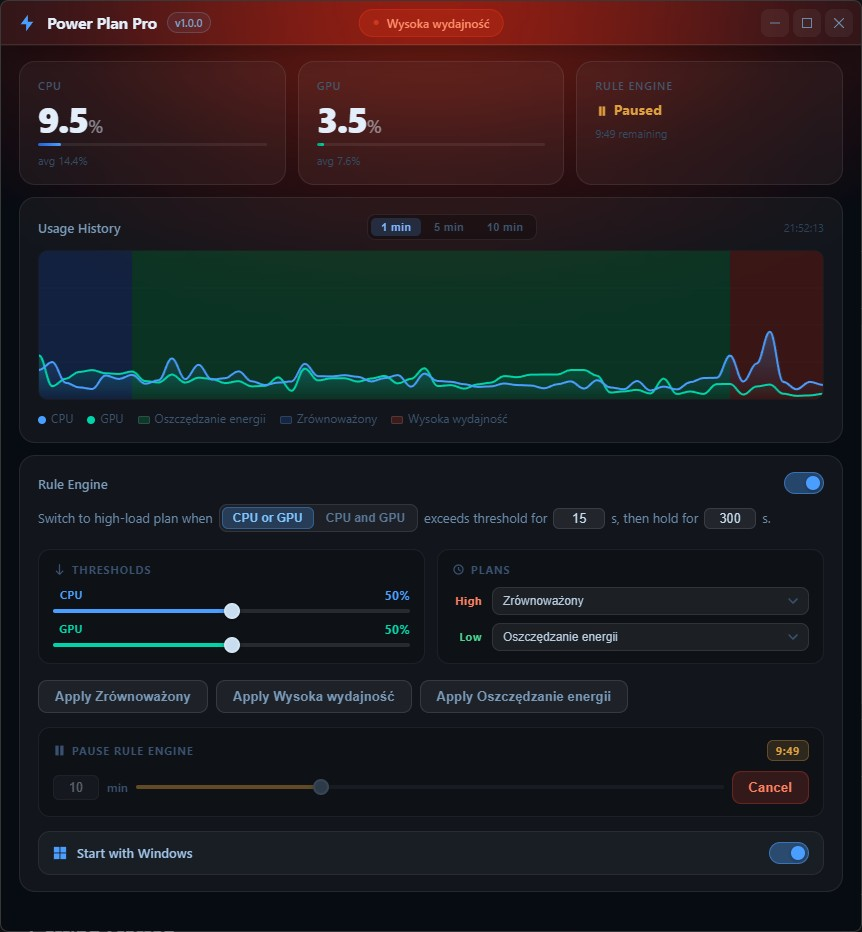
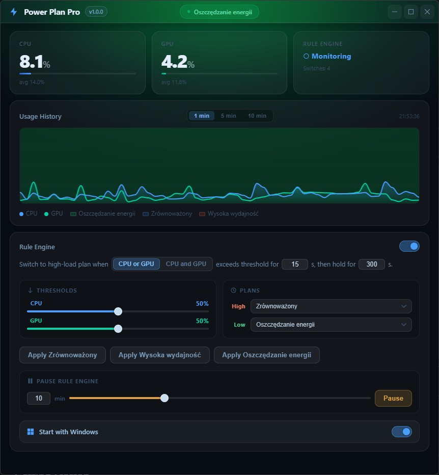

# PowerPlanPro

> A lightweight Windows desktop app that automatically manages your power plans based on real-time CPU and GPU usage. When your system is idle or under light load, PowerPlanPro keeps the CPU in a low-power state - preventing unnecessary clock boosts, reducing heat, and extending hardware longevity - while instantly switching to a performance plan the moment you need it.


---

## Screenshots

<table>
  <tr>
    <td></td>
    <td></td>
    <td></td>
  </tr>
</table>

---

## Features

- ⚡ **Automatic power plan switching** - define CPU/GPU thresholds; the app switches plans for you with cooldowns to prevent flapping
- 📊 **Real-time CPU & GPU monitoring** - live graph with up to 15 minutes of history and selectable time-frame views (1 min / 5 min / 15 min)
- 🔍 **Auto-detects all power plans** - discovers every power plan configured on your system, including custom ones
- 🖱️ **Manual plan selection** - instantly switch between any detected power plan from the UI
- 🖥️ **System tray integration** - runs quietly in the background with a tray icon that reflects the active power plan
- 🪶 **Minimal resource usage** - lightweight native app with near-zero CPU and memory overhead at idle
- 🔄 **External plan detection** - syncs state when you or another tool changes the active plan outside the app
- ⏸️ **Pause rule engine** - temporarily pause automatic switching for up to 24 hours, with a quick-access tray menu shortcut
- 🚀 **Start with Windows** - optional autostart via the Windows registry

---

## Tech Stack

| Layer | Technology |
|---|---|
| Frontend | [Svelte 5](https://svelte.dev) + TypeScript |
| Desktop framework | [Tauri 2](https://tauri.app) |
| Backend | Rust (Edition 2021) |
| Build tool | [Bun](https://bun.sh) + Vite 7 |
| Windows APIs | PDH (CPU & GPU metrics), `powercfg`, WinReg |

The entire app ships as a single native Windows executable with no Electron and no Node.js runtime required.

---

## Project Structure

```
PowerPlanPro/
├── src/                            # Svelte frontend
│   ├── App.svelte                  # Main UI (charts, state, IPC)
│   └── main.ts                     # Frontend entry point
├── src-tauri/                      # Rust backend
│   └── src/
│       ├── main.rs                 # App setup, IPC handlers, window lifecycle
│       ├── engine.rs               # Rule engine (threshold logic, pause, state machine)
│       ├── metrics.rs              # CPU/GPU sampling via Windows PDH
│       ├── power.rs                # Power plan management via powercfg
│       ├── tray.rs                 # System tray menu and icons
│       ├── logging.rs              # File logging with timestamps
│       ├── autostart.rs            # Windows registry autostart
│       └── persist.rs              # Config serialization
├── index.html
├── package.json
├── vite.config.ts
└── src-tauri/tauri.conf.json
```

---

## Prerequisites

- **Windows 10 or later**
- [Rust](https://www.rust-lang.org/tools/install) (stable toolchain)
- [Bun](https://bun.sh) (package manager / runtime)
- Microsoft C++ Build Tools (required by Tauri - included with Visual Studio)

---

## Getting Started

### 1. Clone the repository

```bash
git clone https://github.com/Hybert404/PowerPlanPro.git
cd PowerPlanPro
```

### 2. Install frontend dependencies

```bash
bun install
```

### 3. Run in development mode

```bash
bun run dev:tauri
```

This starts the Vite dev server and the Rust backend together with hot reload.

---

## Building

### Production binary + MSI installer

```bash
bun run build:tauri
```

Output:

```
src-tauri/target/release/          # compiled executable
src-tauri/target/release/bundle/   # MSI installer
```

### Frontend only

```bash
bun run build
```

Output goes to `dist/`.

---

## How It Works

A background Rust thread ticks every second, sampling CPU and GPU usage via the Windows Performance Data Helper (PDH) API. The **rule engine** compares the current usage against your configured thresholds (with And/Or condition mode):

- If usage drops **below** the low threshold → switch to the low-load power plan
- If usage rises **above** the high threshold → switch to the high-load power plan

A configurable cooldown timer prevents the engine from thrashing between plans during brief spikes. The registry is polled every ~3 seconds to detect external plan changes and keep the UI in sync. The frontend communicates with the backend over Tauri's IPC bridge using commands like `set_power_plan` and `get_engine_status`.

---

## Configuration

All settings are accessible from the in-app Settings panel and are persisted to disk automatically.

| Setting | Description |
|---|---|
| Enable automatic switching | Turns the rule engine on or off |
| Condition mode | And (both CPU & GPU must meet thresholds) or Or (either one) |
| CPU threshold | CPU usage % trigger for switching |
| GPU threshold | GPU usage % trigger for switching |
| Duration | Number of seconds to average over before deciding |
| Cooldown | Minimum seconds between automatic switches |
| Low-load plan | Power plan to activate when usage is low |
| High-load plan | Power plan to activate when usage is high |
| Start with Windows | Register autostart entry in the Windows registry |

---

## Contributing

Pull requests are welcome. For major changes, please open an issue first to discuss what you'd like to change.

1. Fork the repo
2. Create your feature branch: `git checkout -b feature/my-feature`
3. Commit your changes: `git commit -m 'Add my feature'`
4. Push to the branch: `git push origin feature/my-feature`
5. Open a pull request

---

## License

[MIT](LICENSE)
